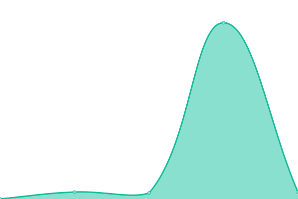
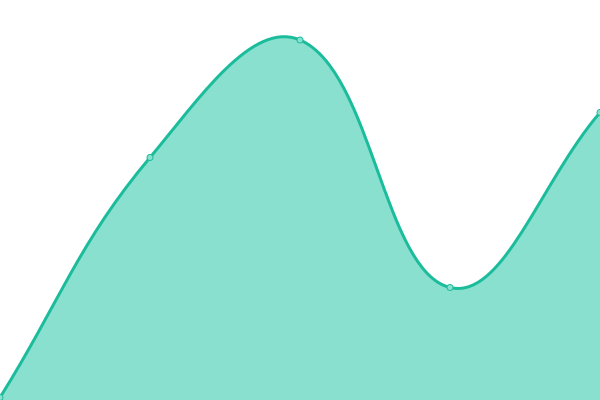

# [📈 Live Status](https://status.carlosbecker.com): <!--live status--> **🟩 All systems operational**

This repository contains the open-source uptime monitor and status page for [Carlos Alexandro Becker](https://caarlos0.dev), powered by [Upptime](https://github.com/upptime/upptime).

With [Upptime](https://upptime.js.org), you can get your own unlimited and free uptime monitor and status page, powered entirely by a GitHub repository. We use [Issues](https://github.com/caarlos0/upptime/issues) as incident reports, [Actions](https://github.com/caarlos0/upptime/actions) as uptime monitors, and [Pages](https://status.carlosbecker.com) for the status page.

<!--start: status pages-->
<!-- This summary is generated by Upptime (https://github.com/upptime/upptime) -->
<!-- Do not edit this manually, your changes will be overwritten -->
<!-- prettier-ignore -->
| URL | Status | History | Response Time | Uptime |
| --- | ------ | ------- | ------------- | ------ |
|  [caarlos0.dev](https://caarlos0.dev) | 🟩 Up | [caarlos0-dev.yml](https://github.com/caarlos0/upptime/commits/master/history/caarlos0-dev.yml) | 

 174ms
     
 | 

<a href="https://status.carlosbecker.dev/history/caarlos0-dev">100.00%</a>
    

|  [carlosbecker.dev](https://carlosbecker.dev) | 🟩 Up | [carlosbecker-dev.yml](https://github.com/caarlos0/upptime/commits/master/history/carlosbecker-dev.yml) | 

 209ms
     
 | 

<a href="https://status.carlosbecker.dev/history/carlosbecker-dev">100.00%</a>
    

|  [carlosbecker.com](https://carlosbecker.com) | 🟩 Up | [carlosbecker-com.yml](https://github.com/caarlos0/upptime/commits/master/history/carlosbecker-com.yml) | 

 131ms
     
 | 

<a href="https://status.carlosbecker.dev/history/carlosbecker-com">100.00%</a>
    

|  [goreleaser.com](https://goreleaser.com) | 🟩 Up | [goreleaser-com.yml](https://github.com/caarlos0/upptime/commits/master/history/goreleaser-com.yml) | 

 84ms
     
 | 

<a href="https://status.carlosbecker.dev/history/goreleaser-com">100.00%</a>
    

|  [nfpm.goreleaser.com](https://nfpm.goreleaser.com) | 🟩 Up | [nfpm-goreleaser-com.yml](https://github.com/caarlos0/upptime/commits/master/history/nfpm-goreleaser-com.yml) | 

 190ms
     
 | 

<a href="https://status.carlosbecker.dev/history/nfpm-goreleaser-com">100.00%</a>
    

|  [starchart.cc](https://starchart.cc) | 🟩 Up | [starchart-cc.yml](https://github.com/caarlos0/upptime/commits/master/history/starchart-cc.yml) | 

 99ms
     
 | 

<a href="https://status.carlosbecker.dev/history/starchart-cc">100.00%</a>
    

|  [watchub.pw](http://app.watchub.pw) | 🟩 Up | [watchub-pw.yml](https://github.com/caarlos0/upptime/commits/master/history/watchub-pw.yml) | 

 121ms
     
 | 

<a href="https://status.carlosbecker.dev/history/watchub-pw">100.00%</a>
    

<!--end: status pages-->

[**Visit our status website →**](https://status.carlosbecker.com)

## 📄 License

- Powered by: [Upptime](https://github.com/upptime/upptime)
- Code: [MIT](./LICENSE) © [Carlos Alexandro Becker](https://caarlos0.dev)
- Data in the `./history` directory: [Open Database License](https://opendatacommons.org/licenses/odbl/1-0/)
